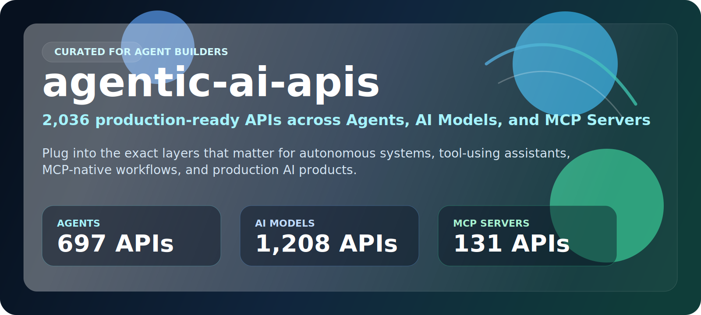

 
 

  <a href="#at-a-glance"><strong>At A Glance</strong></a>
  |
  <a href="#start-here"><strong>Start Here</strong></a>
  |
  <a href="#explore-the-stack"><strong>Explore The Stack</strong></a>
  |
  <a href="#why-this-repo-wins"><strong>Why This Repo Wins</strong></a>
  |
  <a href="#star-history"><strong>Star History</strong></a>

## At A Glance

> The ultimate collection of APIs for building autonomous AI agents - **2,009 production-ready APIs** across **Agents**, **AI Models**, and **MCP Servers**.

This repository is designed to feel like a launchpad, not a junk drawer. It is tightly scoped around the API layers that matter most when you are building autonomous systems, copilots, tool-using assistants, and MCP-native workflows.

| Metric | Count |
|--------|-------|
| Total APIs | 2,009 |
| Categories | 3 |
| Last Updated | 2026-04-08 |
| Focus | Agentic AI infrastructure |

<table>
  <tr>
    <td width="33%" valign="top">
      <h3>Agents</h3>
      
<strong>552 APIs</strong>

      
Execution layers, orchestration, autonomous task handling, and agent-style workflows.

      
<a href="./agents-apis/"><strong>Open Agents Directory</strong></a>

    </td>
    <td width="33%" valign="top">
      <h3>AI Models</h3>
      
<strong>1,198 APIs</strong>

      
Generation, reasoning, extraction, transformation, and model-powered product building blocks.

      
<a href="./ai-models-apis/"><strong>Open AI Models Directory</strong></a>

    </td>
    <td width="33%" valign="top">
      <h3>MCP Servers</h3>
      
<strong>259 APIs</strong>

      
Model Context Protocol integrations that connect assistants to real tools, systems, and data.

      
<a href="./mcp-servers-apis/"><strong>Open MCP Servers Directory</strong></a>

    </td>
  </tr>
</table>

## Start Here

1. Pick the layer you need first: `Agents`, `AI Models`, or `MCP Servers`.
2. Open that category README and scan the API names and descriptions.
3. Click through to the provider page for implementation details, pricing, and docs.
4. Build your shortlist fast instead of wasting hours digging through irrelevant categories.

## Explore The Stack

<strong>Agents</strong>

Best for builders who need APIs that feel closer to execution and autonomy:

- agent workflows
- orchestration layers
- autonomous task completion
- assistant behavior and action loops

[Browse Agents APIs](./agents-apis/)

<strong>AI Models</strong>

Best for builders who need intelligence and generation as a reusable service layer:

- reasoning and inference
- summarization and extraction
- content generation
- analysis and transformation

[Browse AI Models APIs](./ai-models-apis/)

<strong>MCP Servers</strong>

Best for builders who want agents to use tools through structured interfaces:

- MCP-native tool integrations
- external system connectivity
- docs, search, analytics, scheduling, and developer workflows
- assistants that need real-world actions

[Browse MCP Servers APIs](./mcp-servers-apis/)

## Built For

<table>
  <tr>
    <td width="25%" align="center"><strong>Autonomous Assistants</strong></td>
    <td width="25%" align="center"><strong>AI Copilots</strong></td>
    <td width="25%" align="center"><strong>MCP Toolchains</strong></td>
    <td width="25%" align="center"><strong>Internal Automation</strong></td>
  </tr>
  <tr>
    <td width="25%" align="center"><strong>Research Agents</strong></td>
    <td width="25%" align="center"><strong>Workflow Engines</strong></td>
    <td width="25%" align="center"><strong>Tool-Using LLM Apps</strong></td>
    <td width="25%" align="center"><strong>Production AI Features</strong></td>
  </tr>
</table>

## Why This Repo Wins

- It is opinionated. This repo is not trying to be every API category on earth.
- It is agent-native. Everything revolves around the stack needed for autonomous AI systems.
- It is faster to use. The clutter is gone, so discovery is dramatically easier.
- It is better positioned. The repo name, README, and categories now all tell the same story.

## Scope Guarantee

This repository intentionally includes only:

- **Agents** for execution, orchestration, planning, and autonomous workflows
- **AI Models** for inference, generation, analysis, and reasoning
- **MCP Servers** for exposing tools and systems to AI assistants through MCP

Anything outside those three categories has been removed from the tracked repository structure.

## Star History

## Maintenance Notes

- A GitHub Actions workflow now syncs the Apify catalog daily and commits only when upstream data actually changes.
- The generation scripts in [settings](./settings/) are configured to rebuild only the three tracked categories above.
- The visual README layout is now part of the repo's default presentation, not just a temporary pass.
- API links keep the existing affiliate tracking from the upstream source data.
